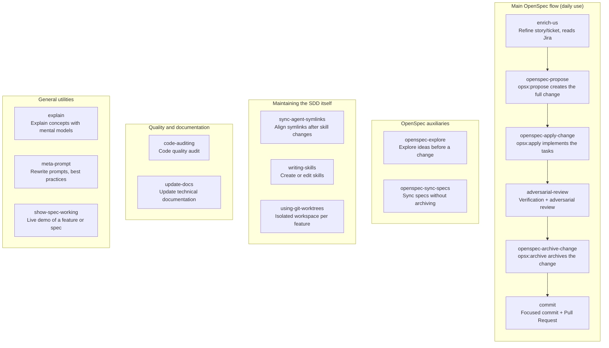
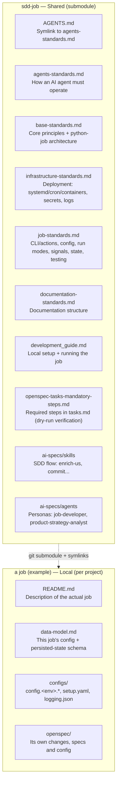

# SDD Job

Base template of **Spec-Driven Development (SDD)** for **python jobs** — command-line batch and
long-running processes (ETL loaders, pollers, reconciliation batches, scheduled generators,
trading loops). It is the combination of
[OpenSpec](https://github.com/Fission-AI/OpenSpec) (the specs/changes/tasks engine) and
[lidr-specboot](https://github.com/LIDR-academy/lidr-specboot) (standards + AI agents), already
reconciled and verified against the installed versions, so the work of aligning commands and
symlinks is not redone every time.

This repo **is not a product**: it is the shared SDD base for python-job projects. Each job repo
adds it as a **git submodule** (it is not copied) and exposes its content at the project root via
symlinks. Anything that is specific to a given job (its configuration, its persisted-state model,
its actions) is created **locally in that job**, never here.

The reference job these standards were extracted from is a trading bot (`mandarina_bot`), but the
standards are **job-agnostic**: `docs/job-standards.md` describes the skeleton
(`core` → command/adapter → pure decision core → persisted state), not any one job's domain.

## What it resolves vs the original specboot

- **OpenSpec version pinned**: 1.5.0. Its commands (`/opsx:propose`, `/opsx:apply`,
  `/opsx:archive`, `/opsx:explore`, `/opsx:sync`) replace the `/new`, `/ff`, `/apply`,
  `/verify`, `/archive` documented by the original specboot (written against ~1.3.1).
- **`/verify` merged into `/adversarial-review`**: OpenSpec 1.5.0 removed the standalone
  `/verify` command. The skill `ai-specs/skills/adversarial-review/SKILL.md` was extended with a
  "Step 0 — Mechanical verification" (completed tasks, tests/lint/typecheck, scenario coverage)
  that runs before the adversarial pass. See that file for the detail.
- **Complete symlinks under `.claude/`**: `openspec init` generates its own skills
  (`openspec-*`) in `.claude/skills/`; here the specboot skills and agents that `openspec init`
  does not ship are additionally linked (relative symlink into `ai-specs/skills/`) —
  `enrich-us`, `commit`, `adversarial-review`, `code-auditing`, `using-git-worktrees`,
  `writing-skills`, `update-docs`, `explain`, `meta-prompt`, `show-spec-working`,
  `sync-agent-symlinks`, and the agents `job-developer`/`product-strategy-analyst` — without
  overriding OpenSpec's native ones.
- **Multi-agent still supported — today only Claude is configured**: config files that were not
  in use were dropped (`.cursor/`, `.vscode/`, `codex.md`, `GEMINI.md`), but the multi-copilot
  **pattern was not removed**: this SDD supports several agents at once (code, documentation,
  image generation…), each with its own specific rules, all sharing the general rules.
  `AGENTS.md` is still a symlink — but to `docs/agents-standards.md` (rules for **how an AI agent
  must operate** in this repo: skills, symlinks, OpenSpec flow), not to `docs/base-standards.md`
  (which is about the project in general, not specifically agents). `CLAUDE.md` is today the only
  real exception (its own file, not a symlink) because it is the only active agent. See
  **"Multi-agent: how to add another copilot"** below for the full pattern.
- **`openspec/config.yaml`** of each job points to `docs/` and `ai-specs/` (the `context` +
  `rules._global` blocks). The shared `*-standards.md` are filled in **here** (inherited by all);
  `docs/data-model.md` (the job's config + state schema) and the job's own `README.md` are filled
  in **per job** (local). See "HOW TO USE" below.
- **`ai-specs/specboot-instructions.md`**: a copy of specboot's original `README.md`, with a note
  at the top mapping its documented flow to this repo's real flow.

The full original specboot document (install, customization, philosophy) is kept in
[`SPECBOOT-UPSTREAM.md`](SPECBOOT-UPSTREAM.md) /
[`ai-specs/specboot-instructions.md`](ai-specs/specboot-instructions.md).

## Workflow (resolved for this repo)

1. `/enrich-us <ticket or text>` — refine a story/idea (reads Jira if given an ID).
2. `/opsx:propose <name-or-description>` — create the change with proposal.md + design.md + tasks.md.
3. `/opsx:apply <change>` — implement the tasks one by one.
4. `/adversarial-review <change>` — mechanical verification (tests/lint/dry-run/tasks) + adversarial review.
5. `/opsx:archive <change>` — archive the completed change.
6. `/commit` — focused commit + Pull Request.

## Available skills

The 16 skills exposed under `.claude/skills/` (symlinks into `ai-specs/skills/`, except the
`openspec-*` ones native to `openspec init`), grouped by function:



## Multi-agent: how to add another copilot

This SDD is designed for several **simultaneous** agents, not just one. Today only `CLAUDE.md`
exists because `Claude` is the only active agent — not because the pattern is limited to it. The
rule is always the same:

> **How any agent must operate → `AGENTS.md`** (symlink to `docs/agents-standards.md`: skills,
> symlinks, OpenSpec flow). **What this project is in general → `docs/base-standards.md`**
> (principles, python-job architecture, language — `agents-standards.md` points there first).
> **Rules specific to one agent → its own file**, additive over `AGENTS.md`, never duplicating
> the general rules.

This applies equally to code, documentation, or image-generation agents — only **where** the
specific file lives changes, because not every agent discovers a root file by name convention.

### Case 1 — a code agent with a root-file convention (like Claude)

1. Create `cursor.md` (or `.cursor/rules/...`, per what the agent expects) at the repo root,
   **with only what is specific to that agent** — just as `CLAUDE.md` only holds its
   "Planning Model Requirement", don't repeat `AGENTS.md` there.
2. That file can start the same way as `CLAUDE.md`: "Read `AGENTS.md` first; this is additive."
3. Symlinks under `.claude/` → `.cursor/` are managed by the `sync-agent-symlinks` skill if the
   agent also consumes skills from `ai-specs/skills`.

### Case 2 — an agent without project-file access (e.g. an image agent)

An agent that doesn't read the repo is operated by prompt (API/UI), usually triggered by a person
or an orchestrator agent. The same general/specific split still holds: put the shared guidance in
a new `docs/*-standards.md` (inherited), and the agent-specific persona in
`ai-specs/agents/<name>.md` (same pattern as `job-developer.md` /
`product-strategy-analyst.md`). Whoever operates the agent combines the two.

### What NOT to do

- Don't create `codex.md`/`GEMINI.md`/`cursor.md` "just in case" without a real agent using them
  — they become orphaned and drift. Create them when the agent actually exists, following the
  pattern above.

## HOW TO USE — what is inherited and what is created per job

The short rule: **if a doc describes how python jobs work in general, it lives here (inherited).
If it describes what a specific job is, it lives in the job (local).**



### Inherited — lives here, reaches the job via submodule + symlink (don't edit in the job)

| File in the job | Symlink to | What it is |
|---|---|---|
| `AGENTS.md` | `sdd-job/AGENTS.md` (itself a symlink to `docs/agents-standards.md`) | How any AI agent must operate: skills, symlinks, OpenSpec flow |
| `CLAUDE.md` | `sdd-job/CLAUDE.md` | Real file (not a symlink) — only what is specific to Claude Code, additive over `AGENTS.md` |
| `docs/agents-standards.md` | `sdd-job/docs/agents-standards.md` | The real file `AGENTS.md` points to — points in turn to `base-standards.md` |
| `docs/base-standards.md` | `sdd-job/docs/base-standards.md` | Core principles: TDD, naming, language, python-job architecture, links to the rest |
| `docs/job-standards.md` | `sdd-job/docs/job-standards.md` | How to build the job: CLI/actions, config, logging, run modes, signals, state, testing, packaging, security |
| `docs/infrastructure-standards.md` | `sdd-job/docs/infrastructure-standards.md` | Deployment (systemd per env, cron, containers), secrets, log rotation |
| `docs/documentation-standards.md` | `sdd-job/docs/documentation-standards.md` | How to maintain documentation |
| `docs/development_guide.md` | `sdd-job/docs/development_guide.md` | Dev environment setup + running the job |
| `docs/openspec-tasks-mandatory-steps.md` | `sdd-job/docs/openspec-tasks-mandatory-steps.md` | Mandatory steps in `tasks.md` (branch, tests, dry-run verification, docs) |
| `ai-specs/` | `sdd-job/ai-specs` | AI skills and agents (`enrich-us`, `commit`, `adversarial-review`, `job-developer`...) |

To change any of these, **edit here** (in `sdd-job`, `main` branch), then update the submodule in
each job (see below) — so the change propagates without duplicating work.

### Local — created and edited in each job, never here

| File | What it is |
|---|---|
| `docs/data-model.md` | The **configuration and persisted-state schema** of that job |
| `configs/` (`config.<env>.*`, `setup.yaml`, `logging.json`) | That job's config, runtime wiring, and logging config |
| `openspec/` (`config.yaml`, `changes/`, `specs/`) | That job's own proposals/tasks/specs history |
| `README.md` | The real description of that job (not this repo's) |

### Set up a new job from scratch

```bash
# 1. Inside the job repo (already with git init and openspec init --tools claude):
git submodule add <sdd-job-repo-url> sdd-job

# 2. Symlinks at the root:
ln -s sdd-job/CLAUDE.md CLAUDE.md
ln -s sdd-job/AGENTS.md AGENTS.md
ln -s sdd-job/ai-specs ai-specs

# 3. Symlinks in docs/ (inherited):
cd docs
for f in base-standards.md agents-standards.md infrastructure-standards.md job-standards.md documentation-standards.md development_guide.md openspec-tasks-mandatory-steps.md; do
  ln -s "../sdd-job/docs/$f" "$f"
done
cd ..

# 4. Local files (create by hand, job-specific):
#    docs/data-model.md, configs/config.<env>.*, configs/setup.yaml, configs/logging.json

# 5. openspec/config.yaml: reference both groups (use this repo's config.yaml as a base)
```

### Clone a job that already uses this submodule

```bash
git clone --recurse-submodules <job-repo-url>
# or if already cloned without --recurse-submodules:
git submodule update --init
```

### Update the submodule to the latest sdd-job in a job

```bash
cd sdd-job && git pull origin main && cd ..
git add sdd-job
git commit -m "chore: bump sdd-job submodule"
```

## Origin

SDD base for python-job projects. Extracted and generalized from a reference trading-bot job
(`mandarina_bot`), which serves as the example of a local job that consumes this repo as a
submodule.
